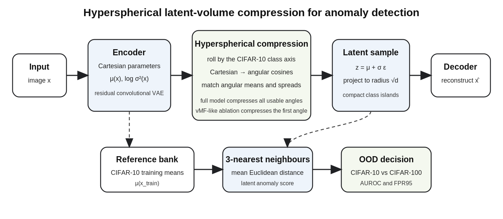
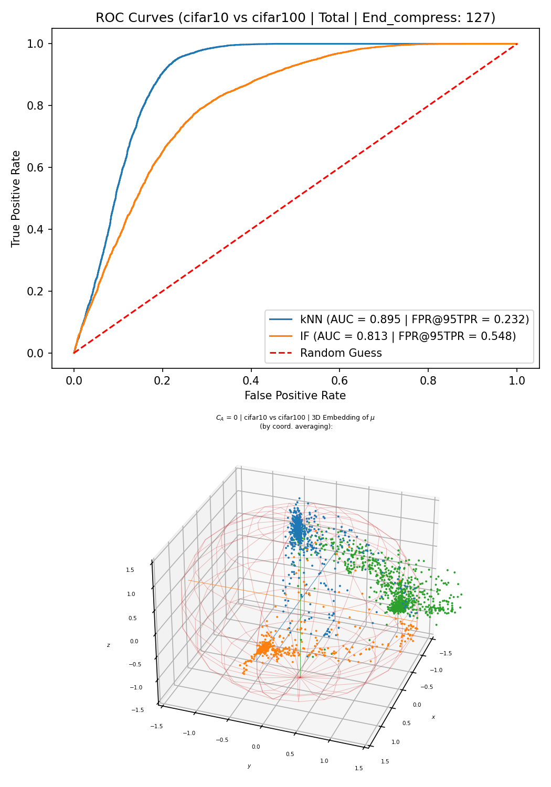

# Hyperspherical Compressed VAE for Anomaly Detection

[](#testing)
[](LICENSE)
[](pyproject.toml)
[](https://pytorch.org/)

A variational autoencoder that reduces high-dimensional latent sparsity by regularizing
**hyperspherical coordinates**, producing compact class-conditioned latent islands for
anomaly and out-of-distribution detection.

<p align="center">
  
</p>

## Core idea

High-dimensional Gaussian latent vectors concentrate near a thin hyperspherical shell but also only
occupy its enormous equatorial regions. A standard Cartesian KLD cannot directly control this
angular volume structure. This implementation converts encoder means and scales to
hyperspherical coordinates and regularizes their angular batch statistics.

For conditional OOD detection, each in-distribution class is associated with a latent axis.
All angular coordinates can then be compressed toward compact class-specific regions. A
3-nearest-neighbour score on the latent means is used for anomaly detection.

## Reference result: CIFAR-10 vs CIFAR-100

CIFAR-10 is the in-distribution training and test dataset. CIFAR-100 is a semantically close,
near-OOD test dataset.

| Method | FPR95 ↓ | AUROC ↑ |
|---|---:|---:|
| Compressed VAE, first-angle/vMF-like | 0.611 | 0.774 |
| **Compressed VAE, full angular compression** | **0.232** | **0.895** |

The exact archived score vector gives AUROC `0.8954305` and FPR95 `0.2323`.

<p align="center">
  
</p>

## Install

```bash
git clone <repository-url>
cd hyperspherical-compressed-vae
python -m venv .venv
source .venv/bin/activate       # Windows: .venv\Scripts\activate
pip install -e .
```

## Verify the exact attached result

No GPU or dataset download is required:

```bash
python scripts/verify_archived_result.py
```

## Reproduce from the supplied checkpoint

```bash
bash scripts/reproduce_cifar10_vs_cifar100.sh
```

This downloads CIFAR-10 and CIFAR-100, encodes the reference and query sets, computes the
3-NN latent anomaly score, and writes:

```text
runs/cifar10_vs_cifar100_reference/
├── metrics.json
├── scores.npz
├── roc_and_scores.png
└── latent_projection.png
```

## Train from scratch

```bash
compvae-train --config configs/cifar10_cifar100_full.yaml
```

The supplied checkpoint history uses a 128-dimensional latent space, `end_compress=126`, target
compression gain 2500, batch size 200, and a 300-epoch pretrained run followed by one additional
evaluation epoch. The CIFAR-100 samples are never used
for training.

The first-angle/vMF-like ablation is configured separately:

```bash
compvae-train --config configs/cifar10_cifar100_vmf.yaml
```

## Package layout

```text
src/compressed_vae/
├── coordinates.py      # differentiable hyperspherical transformations
├── losses.py           # angular and radial compression losses
├── model.py            # checkpoint-compatible residual VAE
├── train.py            # separate encoder/decoder training steps
├── evaluate.py         # CIFAR-10 vs CIFAR-100 reproduction
├── metrics.py          # 3-NN score, AUROC, FPR95
└── visualization.py    # ROC, score histograms, latent projection
```

## Scientific scope

The repository supports the conditional near-OOD experiment highlighted above. The associated
work also studies fully unconditional anomaly detection on Mars Rover Mastcam and Galaxy Zoo,
far-OOD detection from CIFAR-10, and Imagenette versus semantically close ImageNet classes.
Those datasets are not bundled in this initial public release.

The main limitations are that the current compression loss relies on class labels, class-specific
batch statistics, and a fixed axis assignment. Hyperspherical conversion also adds computational
cost that grows with latent dimension.

## Testing

```bash
pytest -q
```

Tests cover coordinate conversion, hyperspherical normalization, model shapes, compression-loss
backpropagation, and anomaly metrics. CI also verifies the exact archived score result.

## Citation

If you use this repository, please cite:

**Alejandro Ascarate, Leo Lebrat, Rodrigo Santa Cruz, Clinton Fookes, and Olivier Salvado.**  
*VAE with Hyperspherical Coordinates: Improving Anomaly Detection from Hypervolume-Compressed Latent Space.*  
arXiv:2601.18823, 2026.  
[Paper on arXiv](https://arxiv.org/abs/2601.18823)

```bibtex
@article{ascarate2026hypersphericalvae,
  title         = {VAE with Hyperspherical Coordinates: Improving Anomaly Detection from Hypervolume-Compressed Latent Space},
  author        = {Ascarate, Alejandro and Lebrat, Leo and Santa Cruz, Rodrigo and Fookes, Clinton and Salvado, Olivier},
  year          = {2026},
  eprint        = {2601.18823},
  archivePrefix = {arXiv},
  primaryClass  = {cs.LG},
  url           = {https://arxiv.org/abs/2601.18823}
}
```

The residual architecture was adapted from the Apache-2.0-licensed Soft-IntroVAE codebase.
See [NOTICE](NOTICE) and [docs/provenance.md](docs/provenance.md).

## License

Apache License 2.0.
